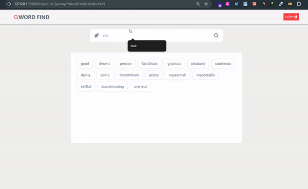

# Synonym wors Finder 🔎 
> 
 

## My Learning 📗🔖
> First time used or real use of these
> 
🖊️ 1. real usecase of split(), join(), filter()  
🖊️ 2. disable=true; and disable=false;  
🖊️ 3. 🔄️ Loader or spinner how to create and used. style.display="hide"  style.display="block"  

## Features 📋
⚡️ Responsive\
⚡️ Copy text and Toast notification\
⚡️ Loader or Spinner\
 

## Tech Stack Used 🛠️
*  HTML
*  CSS3
*  JavaScript
*  API

## Contributor 🤝
### Faheem Ahemad
